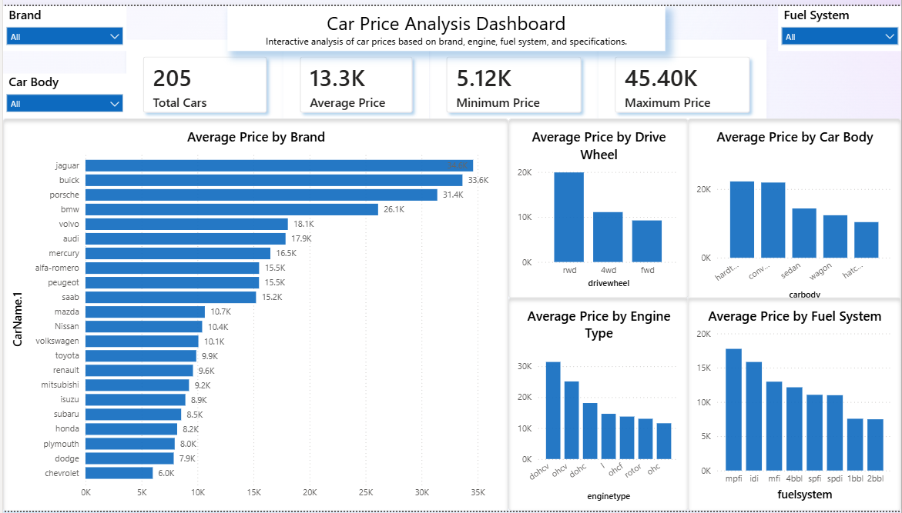
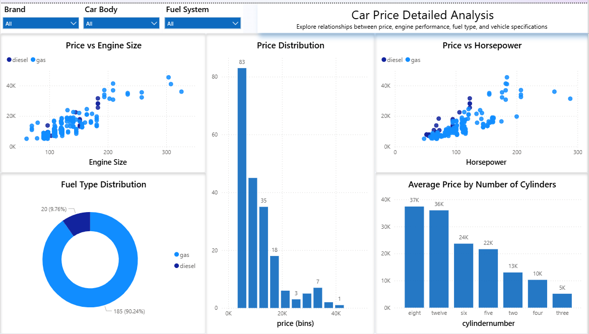
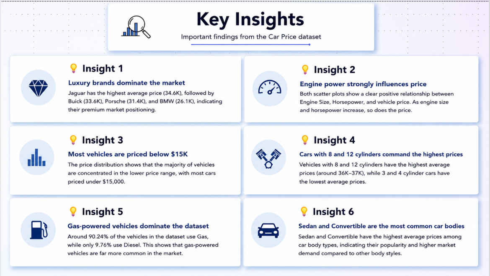

# 🚗 Car Price Analysis Dashboard

## 📌 Project Overview

This project presents an interactive **Power BI Dashboard** built to
analyze car pricing data and identify the major factors that influence
vehicle prices. The dashboard enables users to explore pricing trends
through interactive visualizations and filters, transforming raw data
into meaningful business insights.

------------------------------------------------------------------------

## ✨ Dashboard Features

### 📊 Overview

-   KPI Cards (Average, Maximum, and Minimum Price)
-   Average Price by Brand
-   Average Price by Drive Wheel
-   Interactive Slicers for dynamic filtering

### 📈 Detailed Analysis

-   Price vs. Engine Size
-   Price vs. Horsepower
-   Price Distribution
-   Fuel Type Distribution
-   Average Price by Number of Cylinders

### 💡 Key Insights

A dedicated page summarizing the most important business findings
extracted from the data.

------------------------------------------------------------------------

## 📈 Key Insights

-   Premium brands such as **Jaguar, BMW, and Porsche** have the highest
    average selling prices.
-   Vehicle price generally increases with **engine size** and
    **horsepower**.
-   Most vehicles are priced below **\$15,000**.
-   Cars equipped with **8 and 12 cylinders** tend to have significantly
    higher average prices.
-   **Gas-powered vehicles** dominate the dataset.
-   Engine performance is one of the strongest indicators of vehicle
    price.

------------------------------------------------------------------------

## 🛠 Tools & Technologies

-   Microsoft Power BI
-   Power Query
-   DAX
-   Data Modeling
-   Data Visualization

------------------------------------------------------------------------

## 📷 Dashboard Preview

### Overview

### Detailed Analysis

### Key Insights

------------------------------------------------------------------------

## 🎥 Dashboard Demo

The repository includes a short demonstration video showcasing the dashboard's interactive features.

📂 Location:
demo/dashboard-demo.mp4

------------------------------------------------------------------------

## 🚀 How to Use

1. Download the repository or the `.pbix` file.
2. Open the project using **Microsoft Power BI Desktop**.
3. If prompted, reconnect the dataset (`CarPrice.csv`) by updating the data source path.
4. Use the slicers (Brand, Car Body, and Fuel System) to interact with the dashboard.
5. Navigate between the **Overview**, **Details**, and **Key Insights** pages to explore the analysis.

------------------------------------------------------------------------

## 👨‍💻 Author

**Hussein Khaled**

If you have any feedback or suggestions, feel free to connect with me on
LinkedIn or GitHub.
GitHub: https://github.com/huss148
LinkedIn: https://www.linkedin.com/in/hussain-khaled-77a791316
------------------------------------------------------------------------

### ⭐ If you found this project interesting, consider giving the repository a star!
